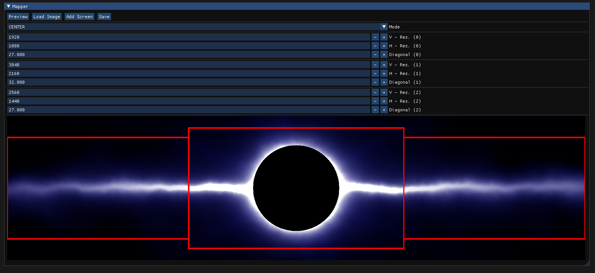

# Multiscreen Wallpaper Mapper

> Bit sized wallpaper utility

  

---

## Table of Contents

- [Description](#description)
- [Libraries](#libraries)
- [License](#license)

---

## Description
This software is just a tiny utility created in a few hours to improve my setup and is therefore not well optimized or even bug free, but it suits my needs well enough.

This tool can take an image and cut it down into smaller images that can be used as wallpaper on a multi-monitor setup, the created images will align across all your monitors according to the selected alignment mode, the resulting images can then be saved to a directory.

---

## Libraries
- **[LWJGL 3](https://www.lwjgl.org/)** : OpenGL Wrapper for Java (and other useful utilities)
- **[ImGui-Java](https://github.com/SpaiR/imgui-java)** : **[Dear ImGui](https://github.com/ocornut/imgui)** wrapper for Java
---

## License
- **[Alban098](https://github.com/Alban098)**

This project is licensed under the **[MIT license](http://opensource.org/licenses/mit-license.php)**
